<h1 align="center">
XBots通用智能体
</h1>
<p align="center">


 
</p>

<p align="center">
 <br>
<b>Figure 1</b>. Structure of XBots.
</p>

## 项目概述

XBots通用智能体是一个具备自动化网页操作能力的智能系统，在基本对话的基础上，通过DeepSeek对用户命令进行决策，可借助浏览器执行多样化的任务。该系统集成了日志管理、对话评估等功能，能依据用户需求精准执行任务，并输出用户预期结果。

## 项目结构

- **`XBots/`**：项目主目录，包含以下关键文件和子目录：
  - **`logs/`**：日志文件夹，记录不同任务的交互过程和结果，包括与用户的对话、操作步骤、提取的信息等。每个任务的日志以 `conversation_*.txt` 格式存储。
  - **`css/`**：Streamlit中使用到的页面样式。
  - **`screenshots/`**：browser-use的运行流程gif。
  - **`sqlStruct/`**：mysql数据库中的表结构，可以直接通过查询命令添加相关表。
  - **`main.py`**：程序入口。
  - **`chat_page.py`**：交互主页面。
  - **`log_handler.py`**：负责日志管理，提供日志管理上下文管理器，可在Streamlit应用中临时添加和移除日志处理器。
  - **`deepseek_api.py`**：用于评估对话是否适合作为 `browser-use` 命令，通过调用DeepSeek API进行判断。
  - **`database.py`**：数据库调用。
  - **`config_loader.py`**：配置文件（config.json）加载器。
  - **`auth.py`**：用户认证模块。
  - **`config.json`**：配置文件，可配置追加词、内嵌链接网页的大小、api重问次数上限。
  - **`requirements.txt`**：列出了运行项目所需的Python库。

## 功能特性

**1. 用户注册与登录**

用户可以在系统中完成注册和登录操作。注册并成功登录后，系统会自动存储用户的 token。下次使用时，用户无需再次输入账号和密码，直接凭借 token 即可快速登录系统。若用户选择在会话页面退出登录，系统会使该 token 失效，保障用户账户安全。

**2. AI 智能聊天**

智能决策：用户登录成功后，可在系统中输入各种任务指令。系统会借助 DeepSeek 对用户的命令进行精准分析和决策，判断是否需要使用浏览器进行操作。

不同响应方式：若不需要浏览器操作，系统将直接通过 API 快速回复用户；若判定需要浏览器操作，系统会调用 browser - use 功能执行任务。执行过程中，系统会输出详细的操作步骤日志，同时提供操作流程的 GIF 动态展示以及相关链接，使用户能清晰了解任务执行情况。

**3. 聊天管理**

系统具备智能的聊天管理功能。当用户开启一个新的对话并首次提问后，系统会通过询问 API 的方式，根据用户的提问内容自动生成一个合适的对话名。这一功能方便用户快速识别和管理不同的对话，提升使用体验。


## 环境要求

Python 3.9 及以上版本

* 所需 Python 库：
  * `streamlit`
  * `sqlalchemy`
  * `pymysql`
  * `werkzeug `
  * `langchain_openai`
  * `pydantic`
  * `dotenv`

## 运行DEMO

1、**克隆项目**

```bash
git clone https://github.com/SuanXiangJi/XBots
cd XBots
```

2、 **安装依赖库 **

```bash
pip install -r requirements.txt
```

3、**配置文件**

在项目根目录下创建 .env 文件，并添加以下配置信息，其余项不用管：

```bash
DEEPSEEK_API_KEY=你的API_Key
DB_HOST=你的主机名
DB_NAME=数据库名
DB_USER=数据库用户名
DB_PASSWORD=数据库密码
```

4、**运行项目**

```bash
python -m streamlit run .\main.py
```

5、**在浏览器中输入网址**

```bash
http://localhost:8501/
```

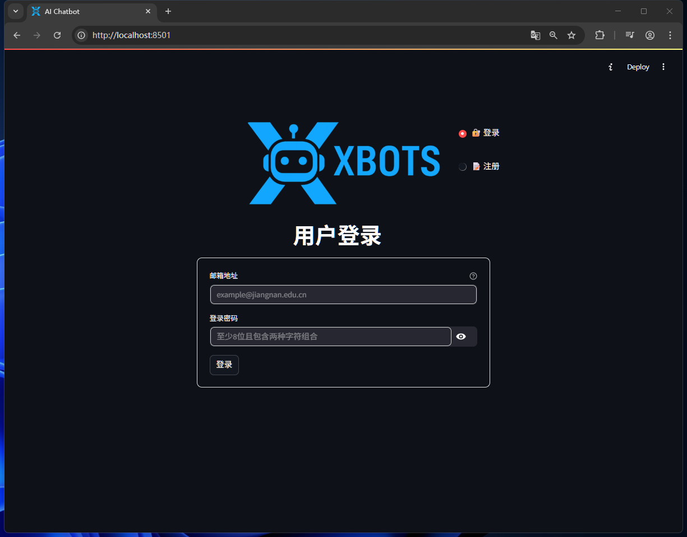

6、**登录、注册**

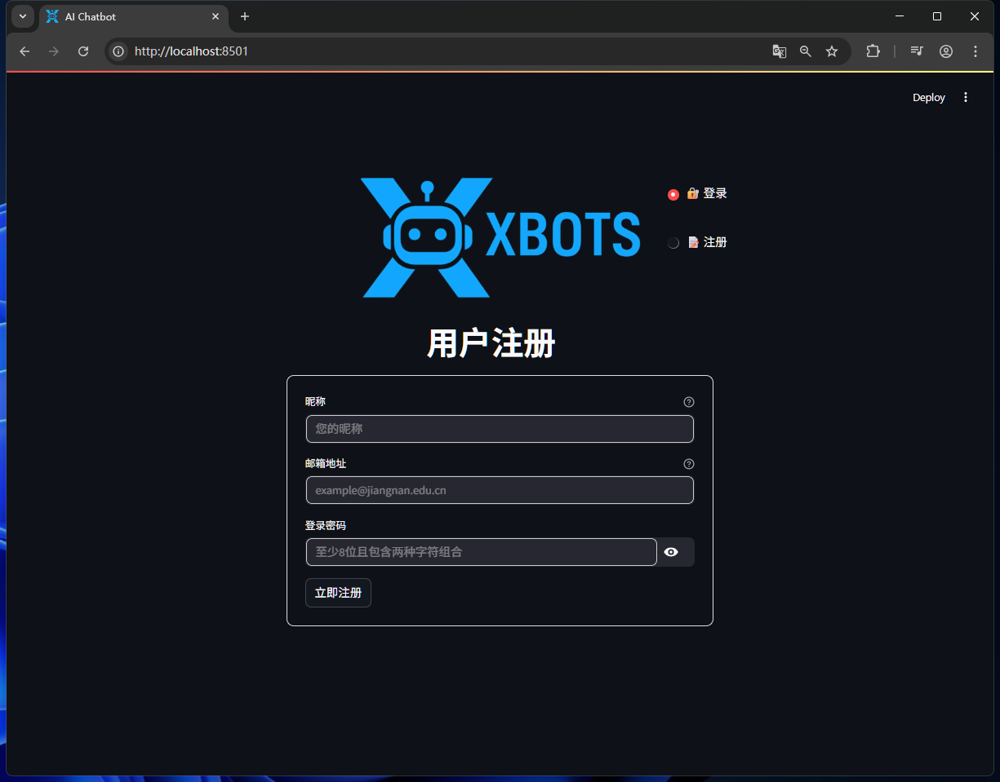

7、**新建对话**

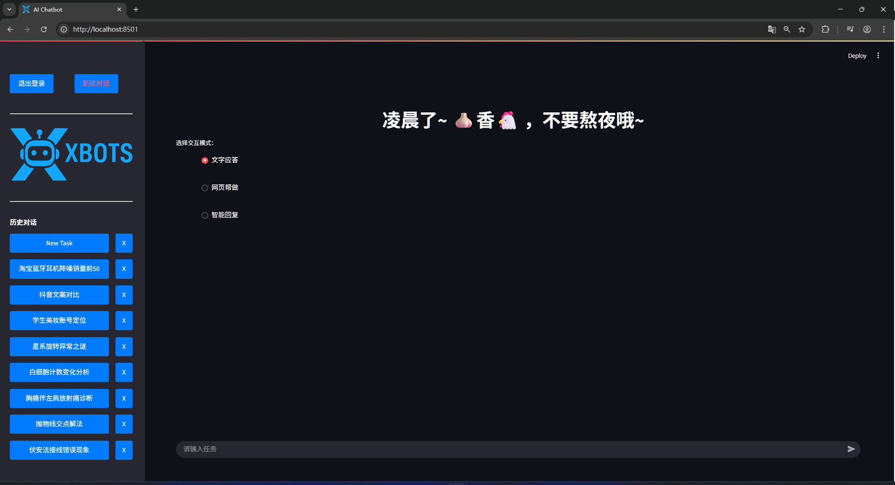

8、**测试“文字应答”模式**


输入问题并按回车键提交，等待“思考”片刻：

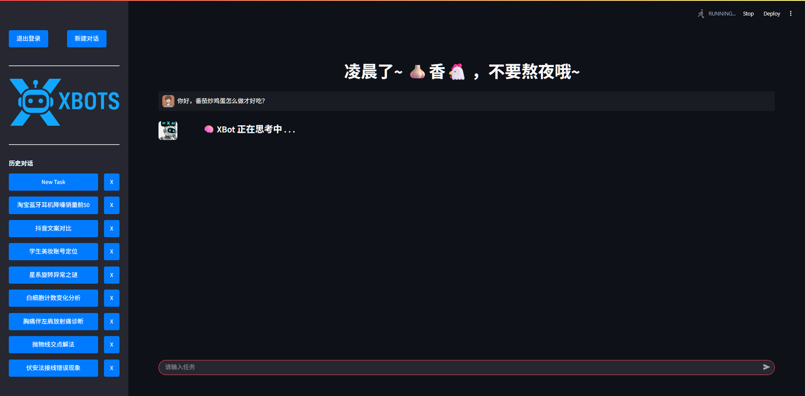

获得应答：

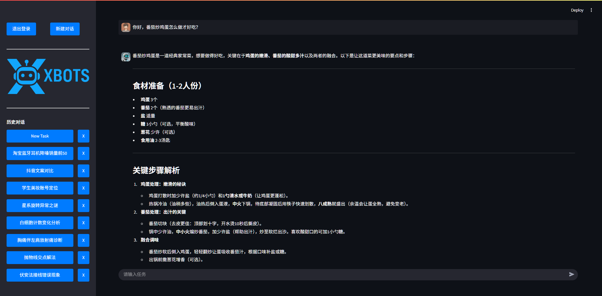

9、**测试“网页帮做”模式**

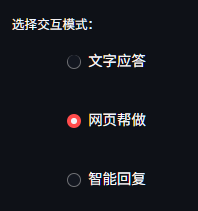


网页开始模拟操作：


XBot返回最终回复：

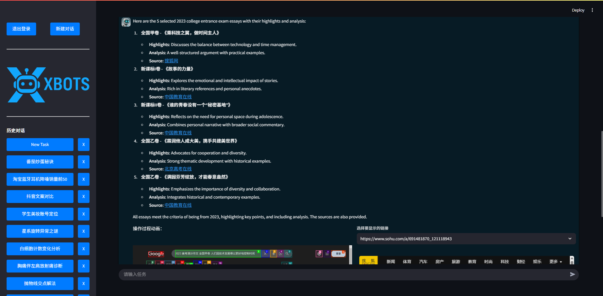

操作流程动画&链接展示：

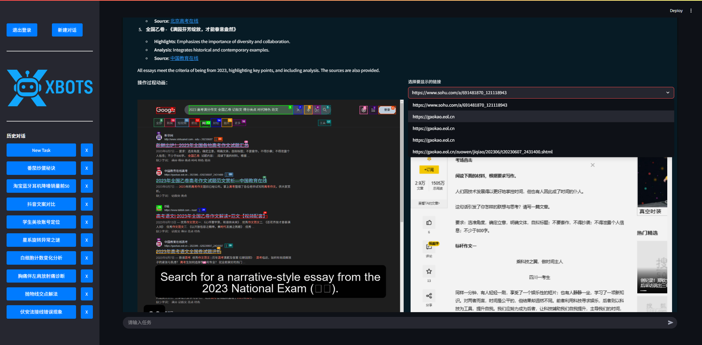

10、**测试“智能回复”模式**

由于DeepSeek存在答复的随机性（不稳定因素），后台需要不断更新评估（config.json中可以配置评估次数）。

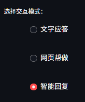

API决策中：


决策完成，决定使用“网页帮做”：

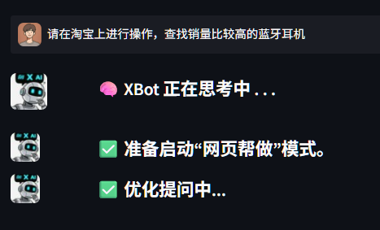

优化网页操作指令：


开启网页操作：


输出最终回答：

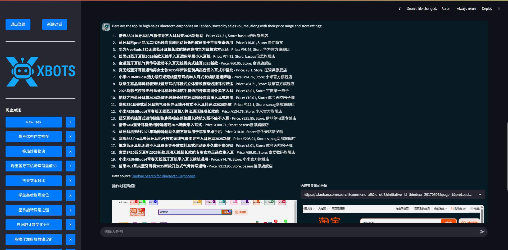

显然，在这次的AI决策下，该命令被判定成了一个“网页帮做”的任务。

11、**“智能回复”模式下连续提问**

决策中...

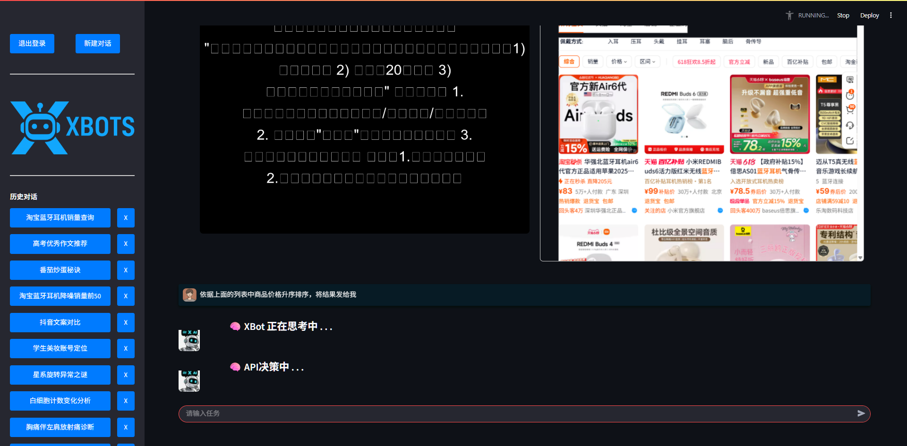

确定应答方式：

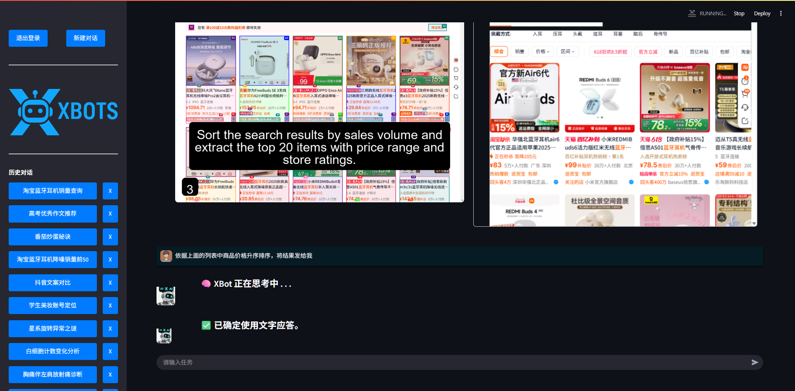

此时，问题被自动判定为“文字应答”：

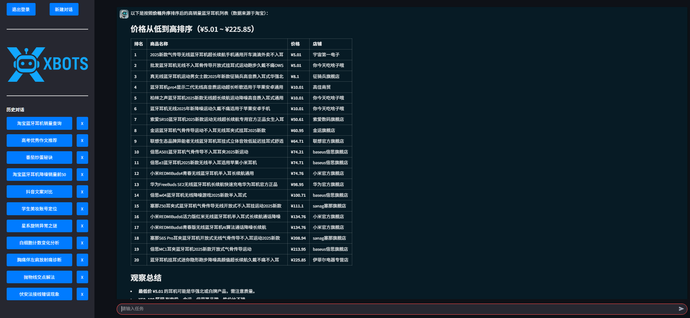

因此，在“智能回复”模式下，用户的命令会通过AI决策，响应更合适的操作。
